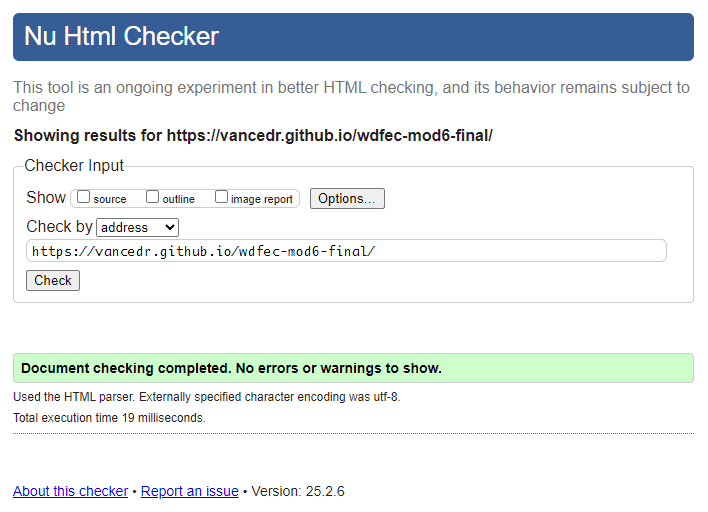
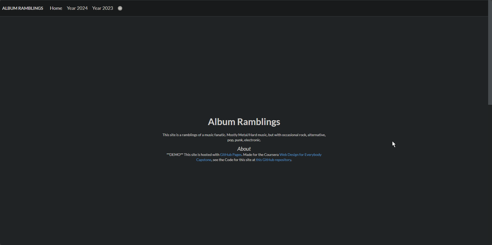

# wdfec-mod6-final
Web Design for Everybody Capstone - Module 6 - Final Project
> [https://vancedr.github.io/wdfec-mod6-final/](https://vancedr.github.io/wdfec-mod6-final/)
# About
The site is a Album Review Blog mostly about Metal/Hard music, but with occasional other genres. This site is made using the [Semantic UI Framework](https://semantic-ui.com/).

## Compliance
1. W3 Validator  

2. WebAIM

3. axe Web Tools

3. Responsive  
- Mobile:  

- Desktop:  

4. Well Styled  
The site uses the Semantic UI CSS with some modifications. See [CSS File](css/styles.css).

## Extras
1. Content is generated dynamically from a JavaScript array of objects. See [JavaScript Code](/js/javascript.js)
2. Embedded Song from the Album through Youtube. See the `albums` variable and the `sample` property at [JavaScript Code](/js/javascript.js)
3. Popup the Embedded Song in a Lightbox-esque view. See the `openPopover()` function at [JavaScript Code](/js/javascript.js), and the `<dialog>` on the [Main Page](index.html).

4. Dark mode toggle using DarkReader, see the `toggleDarkMode()` function at [JavaScript Code](/js/javascript.js)
- Light Mode:

- Dark Mode:

